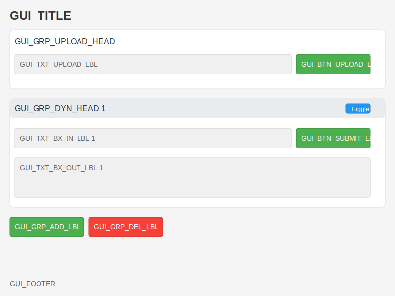

# Azure AI with Gradio MVP


[](https://github.com/qte77/Chat-MVP-Gradio/actions/workflows/codeql.yaml)
[](https://www.codefactor.io/repository/github/qte77/chat-mvp-gradio)
[](https://github.com/qte77/chat-mvp-gradio/actions/workflows/ruff.yaml)
[](https://github.com/qte77/chat-mvp-gradio/actions/workflows/pytest.yaml)
[](https://github.com/qte77/chat-mvp-gradio/actions/workflows/links-fail-fast.yaml)
[](https://github.com/qte77/chat-mvp-gradio/actions/workflows/generate-deploy-mkdocs-ghpages.yaml)
[](https://github.com/codespaces/new?repo=qte77/Chat-MVP-Gradio)
[](https://talktogithub.com/qte77/Chat-MVP-Gradio)

A modular Gradio-based web app for Azure, enabling file uploads, dynamic text group interactions, and custom styling.

## Features

- CSV upload with previews and validation
- Send to Azure model endpoint
- Submit all input to endoint
- Preview CSV and markdown outpout
- Dynamic creation/removal of collapsible text input/output groups
- Custom CSS for a polished UI
- Logging and action notifications

## Quick Start

### Deploy to Azure

```powershell
.\scripts\deploy.ps1
```

### Test Local

```sh
make run_local
```

## GUI sketch



## TODO / Planned Enhancements

- **BAML** for model input/output validation, [BAML integration outline](./assets/baml_integration.md)
- **Health check with /health**
- **Drag-and-drop reordering:** Move text groups up/down.
- **Autosave:** Persist user input across reloads.
- **Remember group state:**
- **Undo/redo:** Revert or repeat changes in groups.
- **Keyboard shortcuts:** Quick actions (e.g., Ctrl+Enter to submit).
- **Localization:** Multi-language UI support.
- **External API integration:** Add AI, translation, or other services.
- **Analytics:** Track usage (with consent).
- **Help/FAQ modal:** In-app user guidance.
- **Voice input/output:** Accessibility enhancements.
- **File previews/icons**
- **Tooltips**

## DONE

- **uv for local development, export requirements.txt for buidling**
- **Validation & error handling:** Guide users and prevent invalid input.
- **Imported env validation** --> pydantic-settings
- **Authentication:** Restrict or personalize user access. --> EntraID
- **Custom themes:** Support for dark mode and branding. --> Gradio onboard
- **Loading indicators** --> Gradio onboard
- **Responsive/mobile design** --> Gradio onboard. Also PWA.
- **Footer/branding**
- **Limit max groups** --> Currently 10 by default.
- **Export/import:** Save/load all group data (e.g., as JSON).
- **Progress indicator:** Show workflow steps.

## Gradio

- [Live Playground](https://www.gradio.app/playground)

## Devcontainer Codepaces

- [devcontainers/images](https://github.com/devcontainers/images/tree/main/src)
- [Development Containers](https://containers.dev/)

## Gradio alternatives

- [streamlit](https://streamlit.io)
- [Dash](https://dashui.codescandy.com/)
- [Plotly](https://plotly.com/python/)
- [PyWebIO](https://pywebio.readthedocs.io/)
- [Textual](https://github.com/Textualize/textual)

## Markdown editors

Embed with `gr.HTML()` and part of `gr.Blocks()`. Serve with `python -m http.server 8080`:

- [Editor.js](http://editorjs.io/)
- [Milkdown](https://milkdown.dev/)
- [CodeMirror](https://codemirror.net/6/), dev, vscode-like
- [Tiptap](https://tiptap.dev/)
- [lexical](https://lexical.dev/)
- [ToastUI](https://ui.toast.com/tui-editor), WYSEWIG, no npm
- [SimpleMDE](https://simplemde.com), no npm
